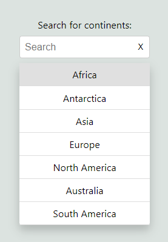

# React Autocomplete Component

This project is a basic Autocomplete component built with React and TypeScript. It allows users to search and select options from a dropdown list, with features like keyboard navigation and filtered selections.
It formed my technical assessment for this company I applied to <3

## Features

- **Autocomplete Search**: Filter options as you type.
- **Keyboard Navigation**: Use arrow keys to navigate options and press Enter to select.
- **Disabled State**: Disable the input field if needed.

## Future enhancements
- **Multiple Selections**: Select multiple options.
